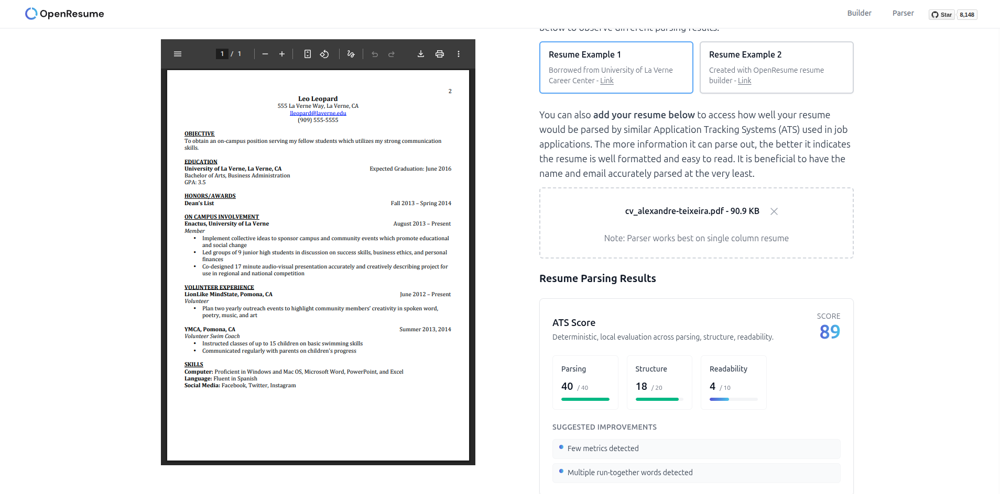

# OpenResume — ATS Scoring + EU/US CV Builder

Try the live demo: [open-resume.alexandreteixeira.dev](https://open-resume.alexandreteixeira.dev/)

This repository is a fork of [OpenResume](https://github.com/xitanggg/open-resume/) by Xitang (full credit to the original creator). The upstream project delivers an open-source resume builder and parser; this fork keeps that foundation while adding ATS scoring, EU/US CV presets, and extra resume fields geared for real-world hiring workflows.

OpenResume is a **free, open‑source resume/CV builder and resume parser** you can run locally. It helps you **build a professional resume**, **evaluate ATS readability**, and get a **resume score** without sending data to third‑party services. It also works as a **resume evaluator** and **ATS resume scoring** tool for testing PDFs before you apply.

## Fork Highlights (What’s new here)

- **Local ATS scoring** with UI + API + CLI access (`/resume-parser`, `POST /api/ats-score`, `npm run ats-score -- ...`)
- **ATS issue details panel** (toggleable diagnostics for every suggested improvement)
- **EU vs US resume presets** (A4 vs Letter + headings) in the builder
- **EU/US parser toggle** so scoring expectations match your region (auto‑syncs from the builder when available)
- **GitHub profile field** in contact details
- **Project link field** that makes titles clickable **and** prints the URL as visible text for parsing
- **Languages section** with proficiency levels (Native / C2 / B1, etc.)
- **GPA field (US only)** — optional in the US builder; only renders when filled
- **Section navigation sidebar** for fast jumps between form sections
- **Typography controls** for body size, name size, section header size, line height, and section spacing
- **Featured Skills** block that can be expanded/collapsed to reduce form clutter
- **Makefile workflow** for install/build/run/clean convenience

If you’re looking for a **free CV builder**, **open‑source resume builder**, or **ATS resume scoring** tool, this fork is designed to be self‑hosted and run fully offline.

## Use Cases

- Build a resume/CV locally with a clean, ATS‑friendly PDF.
- Test a resume with a resume evaluator before applying.
- Run ATS resume scoring offline to validate parsing quality.
- Compare EU (A4) vs US (Letter) assumptions without changing content.
- Use it as a free resume builder and CV builder you can self‑host.

## ATS Scoring System

The local-first ATS scoring engine sits on top of the existing parser. Upload a resume on the parser page and you immediately receive a scorecard, improvement tips, and a breakdown of how applicant tracking systems are likely to interpret the document.

- Grades every resume completely offline—no third-party API calls or data sharing.
- Surfaces structured feedback for parsing reliability, layout heuristics, readability signals, and optional job-description keyword matching.
- Each suggestion can be expanded to show **exact detections** (e.g., glued tokens, missing fields, page-length estimate).
- Keeps parity between UI, REST API (`POST /api/ats-score`), and CLI (`npm run ats-score -- --file resume.pdf [--job job.txt] [--json]`) so the scoring engine can be automated or embedded elsewhere.

For direct API consumption, send the parser output (`textItems`, with optional `lines`, `sections`, and `resume`) to the scoring endpoint. Providing precomputed parser artifacts skips redundant work, and every request remains on-device—no external services involved.

Docs:
- `docs/ATS_SCORING.md` — full scoring logic breakdown
- `docs/ATS_ISSUES.md` — complete list of detected issues and triggers
- `docs/SELF_HOSTING.md` — self‑hosting guide (local only)

**How the score is calculated**

1. **Parsing reliability (40 pts)** – Verifies whether critical fields were correctly extracted by the parser: name, email, phone, location, public links, education entries, and work experiences. Partial data yields partial credit, with issue messages for missing or ambiguous values.
2. **Structure (20 pts)** – Checks single-column layout heuristics, heading detection, bullet consistency, and document length. Suspected multi-column layouts or tables are penalized.
3. **Keywords vs. job description (30 pts, optional)** – If a job description is supplied, the score measures overlap between contract-critical tech keywords, impact verbs, and environment/tools phrases using stemming and contextual text search. Missing matches are reported per category.
4. **Readability (10 pts)** – Rewards quantifiable accomplishments, plain URLs, and robust punctuation while flagging run-together words and a lack of metrics.

When no job description is provided, the score rescales the other three categories to 100 so results remain comparable. The return payload always includes a breakdown plus a de-duplicated issues list (e.g., `"Education details incomplete"`, `"Likely multi-column layout"`).

## Resume Builder

OpenResume's resume builder allows users to create a modern professional resume easily.

It has 5 Core Features:
| 
**Feature**
 | **Description** |
|---|---|
| **1. Real Time UI Update** | The resume PDF is updated in real time as you enter your resume information, so you can easily see the final output. |
| **2. Modern Professional Resume Design** | The resume PDF is a modern professional design that adheres to ATS best practices. It automatically formats fonts, sizes, margins, bullet points to ensure consistency and avoid human errors. |
| **3. Privacy Focus** | The app runs locally in your browser. No sign‑up is required and no data leaves your machine. |
| **4. Import From Existing Resume PDF** | Import an existing PDF to update it into the OpenResume format and continue editing. |
| **5. Successful Track Record** | OpenResume users have landed interviews and offers from top companies, such as Dropbox, Google, and Meta. |

## Resume Parser

OpenResume’s second component is the resume parser. For those who have an existing resume, the resume parser can help test and confirm its ATS readability.

**What’s improved in this fork**
- EU-friendly phone/location detection
- More robust education/work/project extraction
- ATS issue details (toggleable)

You can learn more about the resume parser algorithm in the "Resume Parser Algorithm Deep Dive" section inside the app.

## EU vs US Resume Presets

The builder includes a one-click toggle for **US Resume** vs **EU CV**. It sets sensible defaults for paper size (Letter vs A4) and section headings while keeping ATS-friendly formatting.

The **parser now includes an EU/US toggle** as well, so ATS scoring expectations match your region (A4 vs Letter assumptions).

## Extra Fields Added

- **GitHub profile** in the contact section
- **Project links** (title becomes a link and URL is printed as visible text for parsing)
- **Languages** with proficiency level

## Tech Stack

| 
**Category**
 | 
**Choice**
 | **Descriptions** |
|---|---|---|
| **Language** | [TypeScript](https://github.com/microsoft/TypeScript) | TypeScript is JavaScript with static type checking and helps catch many silly bugs at code time. |
| **UI Library** | [React](https://github.com/facebook/react) | React’s declarative syntax and component-based architecture make it simple to develop reactive reusable components. |
| **State Management** | [Redux Toolkit](https://github.com/reduxjs/redux-toolkit) | Redux toolkit reduces the boilerplate to set up and update a central redux store, which is used in managing the complex resume state. |
| **CSS Framework** | [Tailwind CSS](https://github.com/tailwindlabs/tailwindcss) | Tailwind speeds up development by providing helpful css utilities and removing the need to context switch between tsx and css files. |
| **Web Framework** | [NextJS 13](https://github.com/vercel/next.js) | Next.js supports static site generation and helps build efficient React webpages. |
| **PDF Reader** | [PDF.js](https://github.com/mozilla/pdf.js) | PDF.js reads content from PDF files and is used by the resume parser at its first step to read a resume PDF’s content. |
| **PDF Renderer** | [React-pdf](https://github.com/diegomura/react-pdf) | React-pdf creates PDF files and is used by the resume builder to create a downloadable PDF file. |

## Project Structure

OpenResume is created with the NextJS web framework and follows its project structure. The source code can be found in `src/app`. There are a total of 4 page routes as shown in the table below. (Code path is relative to `src/app`)

| 
**Page Route**
 | **Code Path** | **Description** |
|---|---|---|
| / | /page.tsx | Home page that contains hero, auto typing resume, steps, testimonials, logo cloud, etc |
| /resume-import | /resume-import/page.tsx | Resume import page, where you can choose to import data from an existing resume PDF. The main component used is `ResumeDropzone` (`/components/ResumeDropzone.tsx`) |
| /resume-builder | /resume-builder/page.tsx | Resume builder page to build and download a resume PDF. The main components used are `ResumeForm` (`/components/ResumeForm`) and `Resume` (`/components/Resume`) |
| /resume-parser | /resume-parser/page.tsx | Resume parser page to test a resume’s ATS readability. The main library util used is `parseResumeFromPdf` (`/lib/parse-resume-from-pdf`) |

## 💻 Local Development

### Prerequisites

- **Node.js 20 LTS** (includes npm)
- **npm** (comes with Node.js)

This repo uses Next.js, React, and a Makefile wrapper around npm commands. All builds run locally.

### Why self‑host

- Your resume data never leaves your machine.
- ATS scoring and parsing run offline.
- You can customize templates and fields for your workflow.

### Method 1: npm

1. Download the repo `git clone https://github.com/alteixeira20/open-resume.git`
2. Change the directory `cd open-resume`
3. Install the dependency `npm install`
4. Build a production ready version `npm run build`
5. Start the App with `npm start`
6. Open your browser and visit [http://localhost:3000](http://localhost:3000) to see OpenResume live

### Method 1b: Makefile

1. Download the repo `git clone https://github.com/alteixeira20/open-resume.git`
2. Change the directory `cd open-resume`
3. Install the dependency `make install`
4. Build a production ready version `make build`
5. Start the App with `make run`
6. Open your browser and visit [http://localhost:3000](http://localhost:3000) to see OpenResume live

Other useful targets:
- `make lint` — run ESLint
- `make test` — run tests
- `make ats-score ARGS="--file resume.pdf --json"` — CLI scoring
- `make fclean` — remove `node_modules` and build artifacts

### Method 2: Docker

1. Download the repo `git clone https://github.com/alteixeira20/open-resume.git`
2. Change the directory `cd open-resume`
3. Build the container `docker build -t open-resume .`
4. Start the container `docker run -p 3000:3000 open-resume`
5. Open your browser and visit [http://localhost:3000](http://localhost:3000) to see OpenResume live

## Deploy with Docker (behind reverse proxy)

Use this when running behind a reverse proxy (e.g., Nginx in the same Docker network).

1. `git clone https://github.com/alteixeira20/open-resume.git`
2. `cd open-resume`
3. `docker network create edge` (if it doesn't exist)
4. `docker compose up -d --build`
5. Verify from the proxy container:
   `docker exec nginx wget -qO- http://open-resume:3000 | head`
