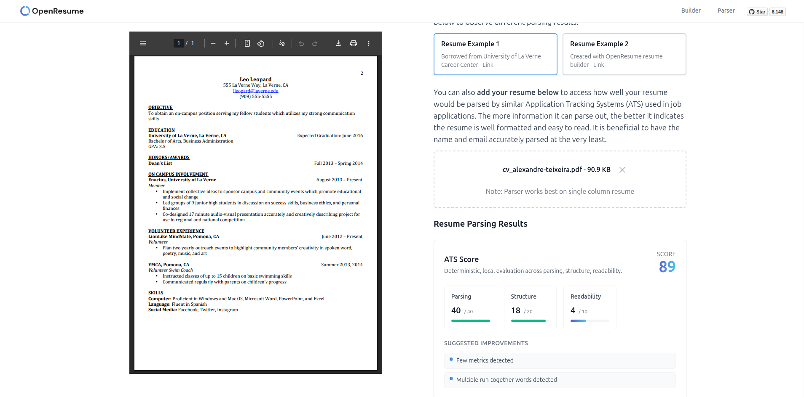

<p align="center">
  
  
  
  
  
  
</p>

<h1 align="center">CVForge</h1>
<p align="center">
  <strong>Forge your career. ATS-ready, EU-native.</strong>
</p>
<p align="center">
  Free, open-source CV builder · Local ATS scoring · EU A4 + US Letter · Privacy-first
</p>
<p align="center">
  <sub>Built on <a href="https://github.com/xitanggg/open-resume">OpenResume</a> by Xitang Zhao
  · Extended and maintained by <a href="https://github.com/alteixeira20">Alexandre Teixeira</a></sub>
</p>

<p align="center">
  <a href="https://cvforge.alexandreteixeira.dev/">Live demo</a>
</p>

<p align="center">
  
  <br />
  <em>Local ATS scoring breakdown inside the Parser Workbench.</em>
</p>

## Table of Contents
1. [At a Glance](#at-a-glance)
2. [About](#about)
3. [Routes](#routes)
4. [How the App Is Built](#how-the-app-is-built)
5. [What This Fork Adds](#what-this-fork-adds)
6. [ATS Scoring](#ats-scoring)
7. [Docs](#docs)
8. [Self-Hosting](#self-hosting)
9. [Deploy with Docker (Behind Reverse Proxy)](#deploy-with-docker-behind-reverse-proxy)
10. [Testing](#testing)
11. [Project Layout](#project-layout)
12. [Maintenance & Upgrades](#maintenance--upgrades)
13. [Credits](#credits)

## At a Glance
> **Highlights:** CV builder, parser workbench, local ATS scoring, and no server-side CV processing.

- `/builder` is the editing workbench: build a CV, preview it live, and export PDF or JSON.
- `/parser` is the parser workbench: upload any PDF and inspect parsing results plus ATS scoring.
- `/resume-import` is the import hub: continue the last session, start fresh, or import PDF/JSON.
- EU A4 and US Letter presets are supported in both building and parsing flows.
- ATS scoring runs locally in the browser UI, and the same scoring core is available through API and CLI entry points.
- Builder state is persisted to local storage so the workbench can restore the last session.

## About
CVForge is a Next.js 16 / React 19 fork of the OpenResume project. It keeps the original local-first CV builder model, then adds a parser workbench, local ATS scoring, EU A4 support, and a more explicit workbench UX around editing and diagnostics.

The app is still built around one printable PDF template rendered with `@react-pdf/renderer`. The builder and parser are separate workbenches that share layout primitives, but they solve different problems:

- The builder workbench edits Redux-backed CV state and renders the live PDF preview.
- The parser workbench reads a PDF with pdf.js, reconstructs text lines and sections, extracts a resume model, and scores it heuristically.
- The import hub bridges those flows by taking JSON exports or PDFs and moving the user back into the builder.

## Routes
- `/` marketing and product overview
- `/builder` Builder Workbench
- `/parser` Parser Workbench
- `/resume-import` import hub

Legacy URLs are still redirected in `next.config.js`:
- `/resume-builder` -> `/builder`
- `/resume-parser` -> `/parser`
- `/ats-checker` -> `/parser`

## How the App Is Built
- **App framework:** Next.js App Router under `src/app`
- **UI:** React 19 + TypeScript + Tailwind 4
- **State:** Redux Toolkit store in `src/app/lib/redux`
- **PDF rendering:** `@react-pdf/renderer` via `src/app/components/Resume/ResumePDF`
- **PDF parsing:** `pdfjs-dist`, copied into `public/pdfjs` by `scripts/copy-pdfjs.mjs`
- **Scoring:** local heuristics in `src/app/lib/ats-score`
- **Shared workbench shell:** `WorkbenchLayout`, `WorkbenchPreview`, and `WorkbenchHeader` under `src/app/components/layout`

The two workbenches intentionally differ only where needed:
- `/builder` uses `ResumeForm` on the left and the React PDF preview on the right.
- `/parser` uses parser controls/results on the left and an iframe-based PDF preview on the right.

## What This Fork Adds
> **Highlights:** a stronger local feedback loop around CV building and PDF parsing.

- **Parser Workbench** at `/parser` for field extraction, diagnostics, and ATS scoring
- **Local ATS scoring** with the same scoring core available in UI, API, and CLI contexts
- **EU A4 + US Letter support** in both generation and parser expectations
- **Import hub** for continuing, starting fresh, or importing PDF/JSON
- **Workbench parity** between the builder and parser shells
- **Theme and typography controls** without changing the underlying PDF engine
- **Extra data fields** like GitHub, project links, and languages

## ATS Scoring
The ATS engine grades a parsed PDF across parsing reliability, structure, readability, and optional job-description keywords. It returns a score plus issues with diagnostic details.

- Full breakdown: `docs/ATS_SCORING.md`
- Issue list: `docs/ATS_ISSUES.md`

## Docs
- Architecture overview: `docs/ARCHITECTURE.md`
- Fork overview and changes: `docs/FORK_OVERVIEW.md`
- Maintenance and upgrades: `docs/MAINTENANCE.md`
- Self-hosting guide: `docs/SELF_HOSTING.md`

## Self-Hosting
**Prerequisites:**
- Node.js **20 LTS** (see `.nvmrc`)
- npm

**Quick start (npm):**
```sh
npm install
npm run build
npm start
```

**Quick start (Makefile):**
```sh
make install
make build
make run
```

## Deploy with Docker (Behind Reverse Proxy)
```sh
git clone https://github.com/alteixeira20/cvforge.git
cd cvforge

docker network create edge   # if it doesn't exist

docker compose up -d --build
```

Verify from your proxy container:
```sh
docker exec nginx wget -qO- http://cvforge:3000 | head
```

## Testing
> **Highlights:** parser heuristics, ATS scoring, and key UI flows have test coverage.

```sh
npm run lint
npm run test:ci
npm run build
```

- Parser coverage: section grouping, bullet extraction, subsection splitting, feature scoring
- ATS coverage: scoring breakdowns, JD keyword impact, EU vs US formats, issue reporting
- UI coverage: locale toggle, import dropzone validation
- Core utils: deep clone/merge helpers, object iterators, class name combinator

## Project Layout
- `src/app` — routes, content files, and UI components
- `src/app/builder` — Builder Workbench route
- `src/app/parser` — Parser Workbench route
- `src/app/resume-import` — import hub route
- `src/app/components/Resume` — live PDF preview and download bridge
- `src/app/components/ResumeForm` — builder controls and editable sections
- `src/app/components/layout` — shared workbench shell primitives
- `src/app/lib` — parsing, ATS scoring, Redux state, and utilities
- `public` — fonts, images, example PDFs, and pdf.js runtime assets
- `docs` — public documentation
- `scripts` — helper scripts such as `copy-pdfjs.mjs`

## Maintenance & Upgrades
This fork is actively maintained with explicit upgrades and compatibility notes:

- **Node 20 LTS** pinned via `.nvmrc`
- **Next 16** with explicit Webpack usage for pdf.js / React PDF compatibility
- **ESLint 9** flat config (`eslint.config.mjs`)
- **Sitemap + robots** via Next route handlers

See `docs/MAINTENANCE.md` for upgrade history and rationale.

## Credits
- Original project: <a href="https://github.com/xitanggg">Xitang Zhao</a>
- Design: <a href="https://www.linkedin.com/in/imzhi">Zhigang Wen</a>
- Fork maintainer: <a href="https://github.com/alteixeira20">Alexandre Teixeira</a>

Licensed under MIT. See `LICENSE`.
